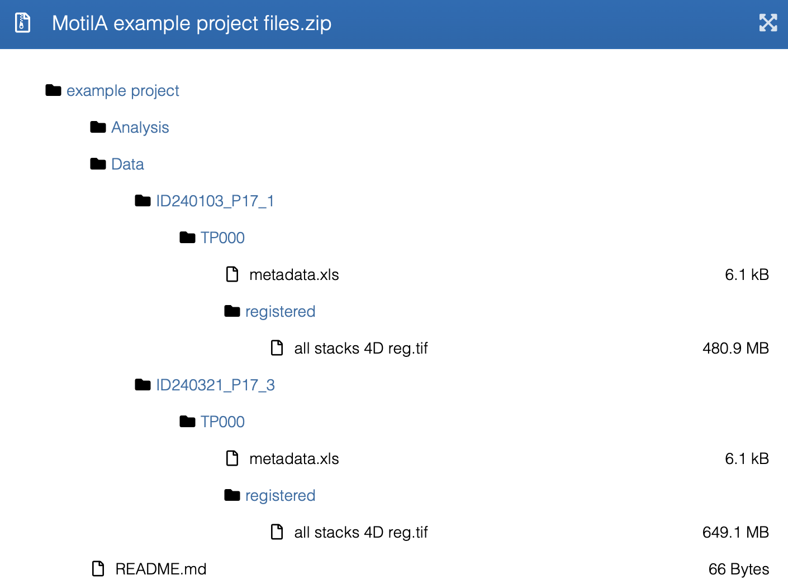

Tutorials and example datasets
==============================

MotilA provides Jupyter notebooks and Python scripts that
demonstrate the complete analysis workflow. Also, an example dataset is
publicly available on Zenodo. These resources enable users to
validate their installation, understand the processing steps and reproduce the
results shown in the associated manuscript.

Example dataset
------------------------

A curated example dataset is available on Zenodo: Gockel & Nieves-Rivera & Musacchio et al. (2025), `doi: 10.5281/zenodo.15061566 <https://zenodo.org/records/15061566>`_;
the dataset is based on `Gockel & Nieves-Rivera et al., 2026 <https://doi.org/10.1016/j.celrep.2026.117161>`_.

The dataset contains:

* a representative 5D time-lapse image stack,
* a corresponding ``metadata.xls`` file with projection center settings, and
* a ready-to-use project folder structure compatible with MotilA.

   Contents of the `Zenodo example dataset <https://zenodo.org/records/15061566>`_, including the required project-folder
   structure for batch processing. The dataset mirrors the directory layout
   expected by MotilA, with ``ID`` folders, ``project_tag`` subfolders,
   registered image stacks, and an accompanying ``metadata.xls`` file.

After downloading, place the dataset into the ``example_project`` directory of
your MotilA working directory (i.e., the folder, where you run the scripts from). 

An example of the expected folder structure can also be found `in the repository <https://github.com/FabrizioMusacchio/MotilA/tree/main/example_project>`_.

Running MotilA directly on this dataset allows users to verify that the pipeline
is functioning correctly and produces meaningful motility metrics.

We also provide a smaller "cutout" version of the example dataset for quick testing and 
demonstration purposes: Musacchio (2025), `doi: 10.5281/zenodo.17803977 <https://zenodo.org/records/17803978>`_.

If you use one of the provided datasets for any purpose beyond the example tutorials, 
please cite both the dataset record (Gockel & Nieves-Rivera & Musacchio et al., 2025, doi: `10.5281/zenodo.15061566 <https://zenodo.org/records/15061566>`_ / 
Musacchio, 2025, doi: `10.5281/zenodo.17803977 <https://zenodo.org/records/17803978>`_) 
and `Gockel & Nieves-Rivera et al., 2026 <https://doi.org/10.1016/j.celrep.2026.117161>`_.

Tutorial notebooks
------------------

MotilA includes Jupyter notebooks that illustrate the core processing steps on
the example data:

* `single_file_run.ipynb <https://github.com/FabrizioMusacchio/MotilA/blob/main/example_notebooks/single_file_run.ipynb>`_  
  Demonstrates the complete workflow for processing a single image stack.

* `batch_run.ipynb <https://github.com/FabrizioMusacchio/MotilA/blob/main/example_notebooks/batch_run.ipynb>`_  
  Shows how to process multiple datasets stored in a structured project folder.

These notebooks guide users through image loading, optional preprocessing,
motility computation and inspection of intermediate and final results. They
serve as the most accessible introduction to the pipeline.

Example Python scripts
----------------------

Equivalent Python scripts are provided for users who prefer script-based
workflows or who want to integrate MotilA into automated analysis pipelines:

* `single_file_run.py <https://github.com/FabrizioMusacchio/MotilA/blob/main/example_scripts/single_file_run.py>`_
* `batch_run.py <https://github.com/FabrizioMusacchio/MotilA/blob/main/example_scripts/batch_run.py>`_

These scripts mirror the behavior of the tutorial notebooks and can be adapted
for larger projects or command-line environments.

Reproducing manuscript figures
------------------------------

The figures shown in the associated manuscript were generated using a dedicated
script that applies MotilA to a specific subset of the example dataset:

* `single_file_run_paper.py <https://github.com/FabrizioMusacchio/MotilA/blob/main/example_scripts/single_file_run_paper.py>`_

The subset used for figure generation is located at:

* ``example_project/Data/ID240103_P17_1_cutout/TP000``

The script contains all parameter settings used during analysis and can be used
to reproduce the manuscript figures exactly.

Additional example datasets
---------------------------

The repository may include additional reduced datasets, project templates or
folder structures intended to help users set up their own analyses. These
resources are located in the ``example_project`` directory and follow the same
format expected by the batch processing routines of MotilA. They can be used as
templates for structuring new experimental datasets.

Example usage
-------------

The following examples illustrate how to use MotilA in practice, starting from
a registered time-lapse stack and proceeding through single-file processing,
batch processing and batch-level result collection.

MotilA uses OMIO to read TIFF/OME-TIFF, CZI, Thorlabs RAW and LSM files and
normalizes them to TZCYX, with T denoting time, Z depth, C channels and X/Y the
spatial dimensions. See the :doc:`data requirements <data_requirements>` for
details on axis order, multi-channel handling and the optional legacy TIFF axis
correction function ``tiff_axes_check_and_correct``.

Single-file processing
~~~~~~~~~~~~~~~~~~~~~~

Import MotilA and initialize logging:

.. code-block:: python

   import motila as mt
   from pathlib import Path

   # verify installation
   mt.hello_world()

   # initialize logger
   log = mt.logger_object()

Parameter selection
^^^^^^^^^^^^^^^^^^^

Before calling :func:`motila.process_stack`, you should choose parameter values
that match your imaging protocol and data quality. A complete description of
all arguments is given in the :doc:`parameter documentation <parameters>`.
Below is a practical guide for the most important groups of parameters.

Projection parameters
"""""""""""""""""""""

The parameters ``projection_center`` and ``projection_layers`` control the
subvolume that is projected:

* For sparsely distributed microglia, a symmetric window of
  approximately 7 to 13 z-layers centered on the cell of interest is
  usually sufficient.
* For densely packed microglia, it is often advisable to process several
  subvolumes with different projection centers in order to reduce overlap
  of processes in the projection.

Ensure that the chosen subvolume fits inside the stack dimensions. MotilA
performs a sanity check and will adjust the subvolume if it exceeds the image
bounds, but this may reduce the effective number of projected slices.

Registration parameters
"""""""""""""""""""""""

If there is visible motion across time, registration should be enabled:

* ``regStack3d=True`` if there is intra-stack motion within the 3D volume
  at each time point (for example breathing or slow drift along z).
* ``regStack2d=True`` if residual lateral drift remains after 3D
  registration or if only projections are available.

The parameter ``template_mode`` controls how the 3D registration template is
computed. A typical choice is ``"mean"`` (default), while ``"median"`` may be
more robust for occasional outlier frames. The parameter
``max_xy_shift_correction`` limits the allowed x/y shift and can be used to
avoid overcorrection if rare frames contain large artefacts.

Histogram equalization and matching
"""""""""""""""""""""""""""""""""""

Two complementary mechanisms adjust contrast and compensate for bleaching:

* ``hist_equalization=True`` applies CLAHE within each stack. This is
  recommended for low-contrast images or uneven illumination. Start with a
  clip limit around ``0.05`` and adjust only if necessary.
* ``hist_match=True`` normalizes the intensity distribution across time.
  Select a representative time point as ``histogram_ref_stack`` (for example
  a mid-sequence frame without strong artefacts).

Histogram equalization improves local contrast but can amplify noise if the
clip limit is chosen too high. Histogram matching makes the time series more
comparable but will transfer noise patterns from the reference stack if that
stack is of poor quality.

Filtering parameters
""""""""""""""""""""

Filtering reduces noise and small artefacts before segmentation:

* ``median_filter_slices`` and ``median_filter_projections`` apply median
  filters either slice-wise or on the 2D projections. Use ``"square"`` with
  odd kernel sizes (such as 3 or 5) for general noise reduction. Use
  ``"circular"`` if you aim to emulate ImageJ or Fiji.
* ``gaussian_sigma_proj`` applies a Gaussian blur on the projection. A
  value around 1 to 2 pixels is a reasonable starting point. Use 0 to
  disable Gaussian smoothing.

Median filtering is useful when salt-and-pepper noise or small speckles
dominate. Gaussian smoothing is useful for reducing high-frequency noise in
otherwise smooth structures.

Spectral unmixing parameters
""""""""""""""""""""""""""""

For two-channel recordings with bleed-through from the second channel into the
microglia channel, enable spectral unmixing:

* Set ``spectral_unmixing=True`` if there is visible contamination of the
  microglia channel by the second channel.
* ``spectral_unmixing_amplifyer`` can be used to slightly amplify the
  microglia channel before subtraction, for example values between 1 and 2.
* ``spectral_unmixing_median_filter_window`` controls smoothing of the
  second channel before subtraction. Typical values are 1 (off), 3 or 5.

Spectral unmixing is most effective when the bleed-through is relatively
uniform and the second channel has good signal-to-noise ratio. If the overlap
is highly non-linear or dominated by noise, unmixing may not improve the
result. 

.. tip::

    The spectral unmixing method implemented in MotilA is 
    rather simple: It just subtracts the second channel from the microglia channel 
    after optional smoothing and amplification. For a more sophisticated approach, 
    consider using dedicated spectral unmixing software or plugins, 
    for example in ImageJ/Fiji or `Spectral Unmixing <https://spectral-unmixing.readthedocs.io>`_) 
    before running MotilA.

Example parameter values
^^^^^^^^^^^^^^^^^^^^^^^^

Below is a minimal, representative parameter configuration taken from the
official tutorial script ``single_file_run.py``. These values demonstrate how
MotilA is typically used on the included example dataset. They are meant as a
practical starting point and can be adapted to your own data.

.. code-block:: python

   # dataset identification
   Current_ID = "ID240103_P17_1"
   group      = "blinded"

   # input file
   DATA_Path  = "../example_project/Data/ID240103_P17_1/TP000/registered/"
   IMG_File   = "all stacks 4D reg.tif"
   fname      = Path(DATA_Path).joinpath(IMG_File)

   # projection settings
   projection_layers = 44
   projection_center = 23

   # output path
   RESULTS_foldername = f"../motility_analysis/projection_center_{projection_center}/"
   RESULTS_Path = Path(DATA_Path).joinpath(RESULTS_foldername)
   mt.check_folder_exist_create(RESULTS_Path)

   # thresholding
   threshold_method = "otsu"
   blob_pixel_threshold = 100
   compare_all_threshold_methods = True

   # image enhancement
   hist_equalization = True
   hist_equalization_clip_limit = 0.05
   hist_equalization_kernel_size = None
   hist_match = True
   histogram_ref_stack = 0

   # filtering
   median_filter_slices = "circular"
   median_filter_window_slices = 1.55
   median_filter_projections = "circular"
   median_filter_window_projections = 1.55
   gaussian_sigma_proj = 1.0

   # channels
   two_channel = True
   MG_channel = 0
   N_channel  = 1

   # registration
   regStack3d = True
   regStack2d = False
   template_mode = "max"
   max_xy_shift_correction = 100

   # spectral unmixing
   spectral_unmixing = True
   spectral_unmixing_amplifyer = 1
   spectral_unmixing_median_filter_window = 3

   # book-keeping
   clear_previous_results = True
   log = mt.logger_object()

Calling the processing function
^^^^^^^^^^^^^^^^^^^^^^^^^^^^^^^

After defining the necessary parameters, run the pipeline:

.. code-block:: python

  mt.process_stack(
    fname=fname,
    MG_channel                   = MG_channel,
    N_channel                    = N_channel,
    two_channel                  = two_channel,
    projection_layers            = projection_layers,
    projection_center            = projection_center,
    histogram_ref_stack          = histogram_ref_stack,
    log                          = log,
    blob_pixel_threshold         = blob_pixel_threshold,
    regStack2d                   = regStack2d,
    regStack3d                   = regStack3d,
    template_mode                = template_mode,
    spectral_unmixing            = spectral_unmixing,
    hist_equalization            = hist_equalization,
    hist_equalization_clip_limit = hist_equalization_clip_limit,
    hist_equalization_kernel_size= hist_equalization_kernel_size,
    hist_match                   = hist_match,
    RESULTS_Path                 = RESULTS_Path,
    ID                           = Current_ID,
    group                        = group, 
    threshold_method             = threshold_method,
    compare_all_threshold_methods= compare_all_threshold_methods,
    gaussian_sigma_proj          = gaussian_sigma_proj,
    spectral_unmixing_amplifyer  = spectral_unmixing_amplifyer,
    median_filter_slices         = median_filter_slices,
    median_filter_window_slices  = median_filter_window_slices,
    median_filter_projections    = median_filter_projections,
    median_filter_window_projections= median_filter_window_projections,
    clear_previous_results       = clear_previous_results,
    spectral_unmixing_median_filter_window= spectral_unmixing_median_filter_window,
    debug_output                 = debug_output,
    stats_plots                  = stats_plots)

For a compact overview of all parameters and their allowed values, see the
:doc:`parameter reference <parameters>`.

Batch processing
~~~~~~~~~~~~~~~~

Batch processing uses the same parameters but operates on multiple datasets
organized in a project folder. In addition, the following parameters control
which datasets are processed and where the results are written:

* ``project_root`` specifies the root directory containing all subject folders.
* ``subject_ids`` selects exact subjects, or ``subject_prefix`` discovers
  matching subjects automatically.
* ``tag_folder_levels`` describes the flexible folder levels below each
  subject.
* ``image_patterns`` selects supported image files by glob pattern; ``None``
  uses MotilA's TIFF/OME-TIFF, CZI, LSM and RAW defaults.
* ``exclude_name_contains`` filters unwanted files or folders such as previews.
* ``results_folder_name`` defines where MotilA results are stored.
* ``skip_processed`` skips files whose expected output already exists and
  records them as already processed in the run report.
* ``metadata_file`` (for example ``"metadata.xls"``) optionally overrides
  parameters such as channel indices or projection centers on a per-dataset
  basis.

A detailed description of the expected folder structure and metadata handling
is given in the :doc:`parameter documentation <parameters>`.

Example batch configuration
^^^^^^^^^^^^^^^^^^^^^^^^^^^

The following parameter set is taken from the tutorial script
``batch_run.py`` and demonstrates how to batch-process the included example
datasets from the Zenodo record:

.. code-block:: python

   PROJECT_ROOT = "../example_project/Data/"

   subject_ids = ["ID240103_P17_1", "ID240321_P17_3"]
   subject_prefix = "ID"

   tag_folder_levels = [
       ("TP000",),
       ("registered",)]

   image_patterns = None
   # image_patterns = ("*reg*.ome.tif", "*reg*.tif")
   exclude_name_contains = ("Preview",)

   # projection settings
   projection_layers = 44
   projection_center = 23

   # thresholding
   threshold_method = "otsu"
   blob_pixel_threshold = 100
   compare_all_threshold_methods = True

   # image enhancement
   hist_equalization = True
   hist_equalization_clip_limit = 0.1
   hist_equalization_kernel_size = (128, 128)
   hist_match = True
   histogram_ref_stack = 0

   # filtering
   median_filter_slices = "circular"
   median_filter_window_slices = 1.55
   median_filter_projections = "circular"
   median_filter_window_projections = 1.55
   gaussian_sigma_proj = 1.0

   # channels
   two_channel = True
   MG_channel = 0
   N_channel = 1

   # registration
   regStack3d = True
   regStack2d = False
   template_mode = "max"
   max_xy_shift_correction = 100

   # spectral unmixing
   spectral_unmixing = True
   spectral_unmixing_amplifyer = 1
   spectral_unmixing_median_filter_window = 3

   # housekeeping
   log = mt.logger_object()

   processing_options = {
       "MG_channel": MG_channel,
       "N_channel": N_channel,
       "two_channel": two_channel,
       "projection_center": projection_center,
       "projection_layers": projection_layers,
       "histogram_ref_stack": histogram_ref_stack,
       "log": log,
       "blob_pixel_threshold": blob_pixel_threshold,
       "regStack2d": regStack2d,
       "regStack3d": regStack3d,
       "template_mode": template_mode,
       "spectral_unmixing": spectral_unmixing,
       "hist_equalization": hist_equalization,
       "hist_equalization_clip_limit": hist_equalization_clip_limit,
       "hist_equalization_kernel_size": hist_equalization_kernel_size,
       "hist_match": hist_match,
       "max_xy_shift_correction": max_xy_shift_correction,
       "threshold_method": threshold_method,
       "compare_all_threshold_methods": compare_all_threshold_methods,
       "gaussian_sigma_proj": gaussian_sigma_proj,
       "spectral_unmixing_amplifyer": spectral_unmixing_amplifyer,
       "median_filter_slices": median_filter_slices,
       "median_filter_window_slices": median_filter_window_slices,
       "median_filter_projections": median_filter_projections,
       "median_filter_window_projections": median_filter_window_projections,
       "clear_previous_results": False,
       "spectral_unmixing_median_filter_window": spectral_unmixing_median_filter_window,
       "debug_output": debug_output,
       "stats_plots": stats_plots}

These values provide a realistic starting point and can be adapted to new
projects by changing the paths, subject selection, folder-tag levels and, if
necessary, the preprocessing and segmentation settings.

The batch-processing call is:

.. code-block:: python

   result = mt.batch_process_stacks(
       project_root           = PROJECT_ROOT,
       subject_ids            = subject_ids,
       subject_prefix         = subject_prefix,
       tag_folder_levels      = tag_folder_levels,
       image_patterns         = image_patterns,
       exclude_name_contains  = exclude_name_contains,
       skip_processed         = True,
       results_folder_name    = "motility_analysis",
       organize_by_image      = True,
       metadata_file          = "metadata.xls",
       load_options           = {"preflight": False},
       processing_options     = processing_options,
       save_options           = {"validate_outputs": True},
       log                    = log,
       verbose                = True)

``result`` contains the discovered, processed, skipped and failed files. MotilA
also updates ``motila_batch_run_report.txt`` in ``PROJECT_ROOT`` after each run.
If errors occur, a timestamped ``motila_batch_error_report_*.txt`` is written in
the project root and shorter per-file reports are written next to affected image
files.

Batch collection
~~~~~~~~~~~~~~~~

After batch processing, the results from multiple datasets can be aggregated
for cohort-level analysis. The key parameters are:

* ``project_root`` pointing to the same project root as in batch processing.
* ``subject_ids`` or ``subject_prefix`` selecting the same subjects.
* ``tag_folder_levels``, ``image_patterns`` and ``exclude_name_contains`` using
  the same discovery settings as ``batch_process_stacks``.
* ``results_folder_name`` specifying the folder where MotilA wrote the
  per-dataset results.
* ``organize_by_image`` matching the processing run.
* ``RESULTS_Path`` defining the output directory for the aggregated cohort
  tables.

Example batch collection configuration
^^^^^^^^^^^^^^^^^^^^^^^^^^^^^^^^^^^^^^

The following configuration mirrors the settings used in the tutorial script
``batch_run.py`` for collecting results from the example_project::

   PROJECT_ROOT = "../example_project/Data/"
   RESULTS_Path = "../example_project/Analysis/MG_motility/"

   subject_ids = ["ID240103_P17_1", "ID240321_P17_3"]
   tag_folder_levels = [
       ("TP000",),
       ("registered",)]

   log = mt.logger_object()

Aggregate results across multiple datasets with:

.. code-block:: python

   collection_result = mt.batch_collect(
       project_root           = PROJECT_ROOT,
       subject_ids            = subject_ids,
       subject_prefix         = "ID",
       tag_folder_levels      = tag_folder_levels,
       image_patterns         = None,
       exclude_name_contains  = ("Preview",),
       results_folder_name    = "motility_analysis",
       organize_by_image      = True,
       RESULTS_Path           = RESULTS_Path,
       log                    = log,
       verbose                = True)

Assessing your results
----------------------

Single-file results include TIFF and PDF files for each processing step as well
as an Excel file ``motility.xlsx`` containing:

* gained pixels (G),
* lost pixels (L),
* stable pixels (S),
* turnover rate (TOR).

Additional Excel files summarize brightness metrics and cell pixel areas. The
brightness measures allow you to assess bleaching and signal stability over
time. The cell pixel area is expected to remain relatively stable if the
microglial cells do not leave the field of view or disappear.

Excel remains MotilA's default table format for backward compatibility. If you
also need plain-text outputs, set ``table_export_formats=("excel", "csv",
"yaml")`` in :func:`motila.process_stack`, :func:`motila.batch_process_stacks`
or :func:`motila.batch_collect`. MotilA then writes matching ``.csv`` and
``.yaml`` sidecar files next to the default ``.xlsx`` tables.

Batch processing generates cohort-level summary files:

* ``all_motility.xlsx``
* ``all_brightness.xlsx``
* ``all_cell_pixel_area.xlsx``
* ``average_motility.xlsx``

These files can be used to compare experimental groups, quantify effects of
manipulations and create summary plots for publication.

.. Summary
.. -------

.. MotilA provides a complete set of resources for learning and validating the
.. pipeline:

.. * a publicly available Zenodo dataset,
.. * Jupyter notebooks for interactive exploration,
.. * Python scripts for automated workflows, and
.. * a dedicated dataset and script for reproducing manuscript figures.

.. Together, these materials offer a reproducible and practical starting point for
.. using MotilA on real multiphoton imaging data.
